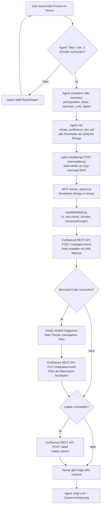

# Auto-Doc-Bot

Automatische Erstellung von Confluence-Dokumentationsseiten über einen Microsoft 365 Copilot Agent. Ein einziger MCP-Server (`create_confluence_doc`) übernimmt alles: Wiki Markup generieren, Seite erstellen, Mermaid-Diagramm serverseitig via `mmdc` rendern, als Attachment hochladen und Labels setzen.

## Architektur

```
User (Teams / M365 Copilot)
    → Copilot Agent (Microsoft Copilot Studio)
    → ngrok Tunnel (Port 8080)
    → nginx Reverse Proxy
        /mermaid/mcp → mcp-mermaid:3000 (create_confluence_doc)
    → Confluence Cloud REST API
```

Der Agent sendet nur strukturierte Plaintext-Daten (Semikolon-getrennt). Der Server baut daraus Wiki Markup, rendert das Diagramm und erstellt die Seite.

## Detaillierter Ablauf



### Ablauf im Detail

| Schritt | Komponente | Aktion | API / Tool |
|---------|-----------|--------|------------|
| 1 | User | Beschreibt Prozess im Chat | Teams → Copilot |
| 2 | Agent | Prüft Vollständigkeit (Titel + 3 Schritte) | System Prompt Logik |
| 3 | Agent | Extrahiert strukturierte Daten | LLM Reasoning |
| 4 | Agent | Ruft MCP-Tool auf | `create_confluence_doc` (6 String-Parameter) |
| 5 | nginx | Routet Request | `/mermaid/mcp` → `mcp-mermaid:3000/mcp` |
| 6 | Server | Parsed Semikolon-Listen | `parseList()` |
| 7 | Server | Sanitized Mermaid-Code | `\n` → Newline, `@` → `(at)`, `&` → `und` |
| 8 | Server | Baut Wiki Markup | `buildWikiMarkup()` → h1, h2, #, *, {info} |
| 9 | Server | Erstellt Confluence-Seite | `POST /rest/api/content` (wiki representation) |
| 10 | Server | Rendert Diagramm | `mmdc -t dark -b transparent` → PNG |
| 11 | Server | Lädt Attachment hoch | `PUT /rest/api/content/{id}/child/attachment` |
| 12 | Server | Setzt Labels | `POST /rest/api/content/{id}/label` |
| 13 | Agent | Zeigt Ergebnis | Page-URL + Zusammenfassung |

### Fehlerbehandlung

| Situation | Verhalten |
|-----------|-----------|
| Titel existiert bereits | Automatischer Retry mit Datum-Suffix (`Titel - 2026-02-19`) |
| Mermaid-Rendering schlägt fehl | Seite wird trotzdem erstellt, Warnung im Response |
| Label-Setzen schlägt fehl | Seite bleibt bestehen, Warnung im Response |
| Sonderzeichen im Diagramm (`@`, `&`) | Serverseitiger Fallback-Sanitizer |

## Voraussetzungen

- Docker + Docker Compose Plugin (v2)
- Öffentlich erreichbarer Server (Azure VM oder ngrok für lokale Entwicklung)
- Microsoft 365 Copilot Studio Zugang
- Atlassian API Token (https://id.atlassian.com/manage-profile/security/api-tokens)

## Setup

### 1. Environment konfigurieren

`.env` Datei mit Confluence-Zugangsdaten:

```env
CONFLUENCE_URL=https://your-domain.atlassian.net/wiki
CONFLUENCE_USERNAME=your-email@example.com
CONFLUENCE_API_TOKEN=your-api-token
```

Optional (Defaults sind konfiguriert):
```env
CONFLUENCE_SPACE_KEY=~your-space-key
CONFLUENCE_PARENT_ID=your-parent-page-id
```

### 2. Docker Stack starten

```bash
docker compose up -d
```

Prüfen ob alle Services laufen:

```bash
docker compose ps
# nginx-proxy-v2, mcp-atlassian-v2 (healthy), mcp-mermaid-v2
```

### 3a. Lokale Entwicklung — ngrok Tunnel

```bash
ngrok http 127.0.0.1:8080
```

> **Windows-Hinweis:** `ngrok http localhost:8080` schlägt fehl, weil `localhost` zu `[::1]` (IPv6) aufgelöst wird, Docker aber nur IPv4 bindet. Immer `127.0.0.1` verwenden.

Die angezeigte HTTPS-URL notieren (z.B. `https://abc123.ngrok-free.app`).

### 3b. Produktionsbetrieb — Azure VM

Empfohlen für dauerhaften Betrieb ohne URL-Änderungen bei jedem Neustart.

**Voraussetzungen:**
- Ubuntu 24.04 VM mit öffentlicher IP in Azure
- Ports 80 und 443 in der Azure Network Security Group (NSG) geöffnet

**Azure DNS Label setzen (kostenlos):**
```
Azure Portal → VM → Öffentliche IP → Konfiguration
→ DNS-Namensbezeichnung: z.B. "mcp-autodocbot"
→ Ergibt: mcp-autodocbot.germanywestcentral.cloudapp.azure.com
```

**Docker Compose Plugin installieren:**
```bash
sudo apt remove docker-compose -y
sudo apt install ca-certificates curl -y
sudo install -m 0755 -d /etc/apt/keyrings
curl -fsSL https://download.docker.com/linux/ubuntu/gpg | sudo gpg --dearmor -o /etc/apt/keyrings/docker.gpg
sudo chmod a+r /etc/apt/keyrings/docker.gpg
echo "deb [arch=$(dpkg --print-architecture) signed-by=/etc/apt/keyrings/docker.gpg] \
  https://download.docker.com/linux/ubuntu noble stable" | \
  sudo tee /etc/apt/sources.list.d/docker.list > /dev/null
sudo apt update && sudo apt install docker-compose-plugin -y
```

**SSL-Zertifikat mit Let's Encrypt:**
```bash
sudo apt install nginx certbot python3-certbot-nginx -y
sudo ufw allow 80/tcp && sudo ufw allow 443/tcp
```

`/etc/nginx/nginx.conf` — im `http { }` Block ergänzen (nötig bei langen Azure-Domainnamen):
```nginx
http {
    server_names_hash_bucket_size 128;
    ...
}
```

```bash
sudo certbot --nginx -d mcp-autodocbot.germanywestcentral.cloudapp.azure.com
```

**Host-nginx als SSL-Terminator** (`/etc/nginx/sites-available/mcp`):
```nginx
server {
    listen 443 ssl;
    server_name mcp-autodocbot.germanywestcentral.cloudapp.azure.com;

    ssl_certificate /etc/letsencrypt/live/mcp-autodocbot.germanywestcentral.cloudapp.azure.com/fullchain.pem;
    ssl_certificate_key /etc/letsencrypt/live/mcp-autodocbot.germanywestcentral.cloudapp.azure.com/privkey.pem;

    location / {
        proxy_pass http://localhost:8080;
        proxy_set_header Host $host;
        proxy_set_header X-Real-IP $remote_addr;
    }
}
```

```bash
sudo ln -s /etc/nginx/sites-available/mcp /etc/nginx/sites-enabled/
sudo nginx -t && sudo systemctl reload nginx
```

**Auto-Start bei VM-Reboot** (`/etc/systemd/system/mcp.service`):
```ini
[Unit]
Description=Auto-Doc-Bot MCP Stack
After=docker.service
Requires=docker.service

[Service]
WorkingDirectory=/home/<user>/mcp/V2
ExecStart=/usr/bin/docker compose up
ExecStop=/usr/bin/docker compose down
Restart=always

[Install]
WantedBy=multi-user.target
```

```bash
sudo systemctl enable mcp && sudo systemctl start mcp
```

**Verbindung testen:**
```bash
curl -X POST https://mcp-autodocbot.germanywestcentral.cloudapp.azure.com/mermaid/mcp \
  -H "Content-Type: application/json" \
  -H "Accept: application/json, text/event-stream" \
  -d '{"jsonrpc":"2.0","method":"initialize","id":1,"params":{"protocolVersion":"2024-11-05","capabilities":{},"clientInfo":{"name":"test","version":"1.0"}}}'
```

Erwartete Antwort: `{"jsonrpc":"2.0","id":1,"result":{"serverInfo":{"name":"..."},...}}`

### 4. Copilot Studio konfigurieren

1. Neuen Agent in Microsoft Copilot Studio erstellen
2. Einen MCP-Server als Tool-Provider hinzufügen:
   - Lokal: `https://<ngrok-url>/mermaid/mcp`
   - Produktion: `https://mcp-autodocbot.germanywestcentral.cloudapp.azure.com/mermaid/mcp`
3. Inhalt von `system_prompt.md` als Agent Instructions einfügen
4. Agent veröffentlichen und testen

## Projektstruktur

```
V2/
├── docker-compose.yml         ← Docker Stack (3 Services: nginx, mcp-atlassian, mcp-mermaid)
├── .env                       ← Confluence Credentials
├── mcp-mermaid/
│   ├── Dockerfile             ← Node 20 + Chromium + mmdc
│   ├── server.js              ← All-in-One MCP-Server (create_confluence_doc)
│   ├── package.json           ← Dependencies
│   └── puppeteer-config.json  ← Chromium --no-sandbox Config
├── mcp-server/
│   └── Dockerfile             ← Python 3.12 + mcp-atlassian (Backup, nicht aktiv)
├── nginx/
│   └── nginx.conf             ← Reverse Proxy (Pfad-Routing)
├── system_prompt.md           ← Copilot Agent Instructions
├── layout_template.md         ← Confluence Wiki Markup Template (Referenz)
├── SESSION_HISTORY.md         ← Entwicklungsprotokoll
└── README.md                  ← Diese Datei
```

## MCP-Tool: `create_confluence_doc`

Ein einziges Tool das alles erledigt. Alle Parameter sind einfache Strings (Semikolon als Trennzeichen):

| Parameter | Beschreibung | Beispiel |
|-----------|-------------|---------|
| `title` | Seitentitel | `Onboarding neuer Mitarbeiter` |
| `summary` | Kurze Zusammenfassung | `Ablauf fuer den ersten Arbeitstag` |
| `prerequisites` | Voraussetzungen (`;`-getrennt, oder leer) | `Laptop bestellt; Zugaenge beantragt` |
| `steps` | Prozessschritte (`;`-getrennt) | `HR informiert IT; Unterlagen pruefen` |
| `mermaid_code` | Mermaid flowchart TD (oder leer) | `flowchart TD\n  A[Start] --> B[Ende]` |
| `labels` | 2 Labels: Kategorie + Thema (`;`-getrennt) | `process; onboarding` |

### Label-Taxonomie

| Kategorie | Wann verwenden |
|-----------|---------------|
| `process` | Schritt-für-Schritt Abläufe |
| `guideline` | Richtlinien, Best Practices |
| `checklist` | Prüflisten |
| `troubleshooting` | Fehlerbehebung |
| `reference` | Nachschlagewerke, Konfigurationen |

Zweites Label = Thema (frei, Kleinbuchstaben): z.B. `onboarding`, `deployment`, `security`, `invoicing`

## Bekannte Einschränkungen

- **ngrok Free Tier:** URL ändert sich bei jedem Neustart. Muss in Copilot Studio aktualisiert werden. → Für Produktion: Azure VM mit DNS Label verwenden (siehe Setup 3b).
- **Copilot Safety Filter:** Wiki Markup in Tool-Parametern wird als Prompt Injection blockiert (`openAIIndirectAttack`). Deshalb wird alle Formatierung serverseitig gemacht — der Agent sendet nur Plaintext.
- **Komplexe Tool-Schemas:** Copilot Studio führt Tools mit Arrays oder verschachtelten Objekten nicht aus. Deshalb nur einfache Strings mit Semikolon-Trennung.
- **Mermaid Sonderzeichen:** `@`, `&`, `<`, `>` brechen die Mermaid-Syntax. Der Agent vermeidet diese im Diagramm (E-Mail-Adressen etc. nur in den Schritten). Server-Fallback sanitiert zusätzlich.

## Technische Details

### MCP Transport
Der MCP-Server nutzt `streamable-http` (nicht SSE). nginx routet `/mermaid/mcp` zum internen Service auf Port 3000. Factory-Pattern: jede MCP-Session bekommt eine eigene `McpServer`-Instanz.

### Wiki Markup
Confluence Wiki Markup Syntax (nicht Markdown), serverseitig generiert in `buildWikiMarkup()`:
- Überschriften: `h1.` `h2.`
- Nummerierte Liste: `# Schritt`
- Aufzählung: `* Punkt`
- Info-Panel: `{info:title=Titel}Text{info}`
- Ausklappbarer Bereich: `{expand:title=Titel}Inhalt{expand}`
- Attachment-Bild: `!dateiname.svg!` (SVG bevorzugt, PNG als Fallback)

### Mermaid Rendering
- Serverseitig via `mmdc` (@mermaid-js/mermaid-cli) mit Chromium
- Dark Theme (`-t dark`) mit transparentem Hintergrund (`-b transparent`)
- Literale `\n` vom LLM werden automatisch in echte Newlines konvertiert
- Sonderzeichen-Fallback: `@` → `(at)`, `&` → `und`
